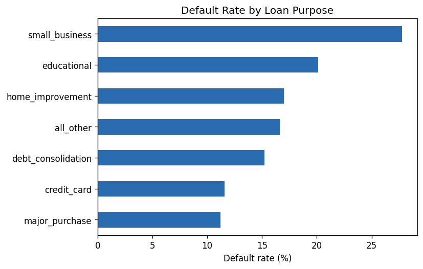
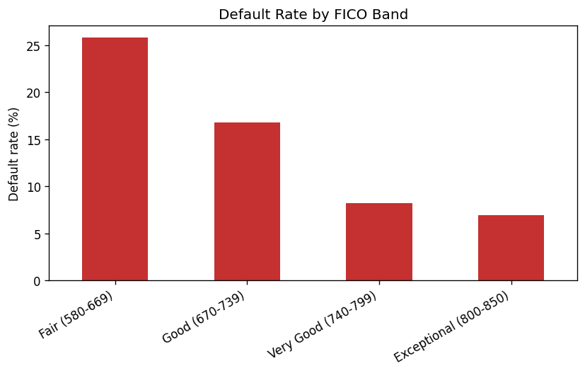
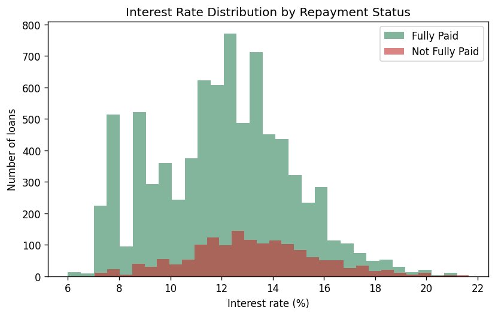
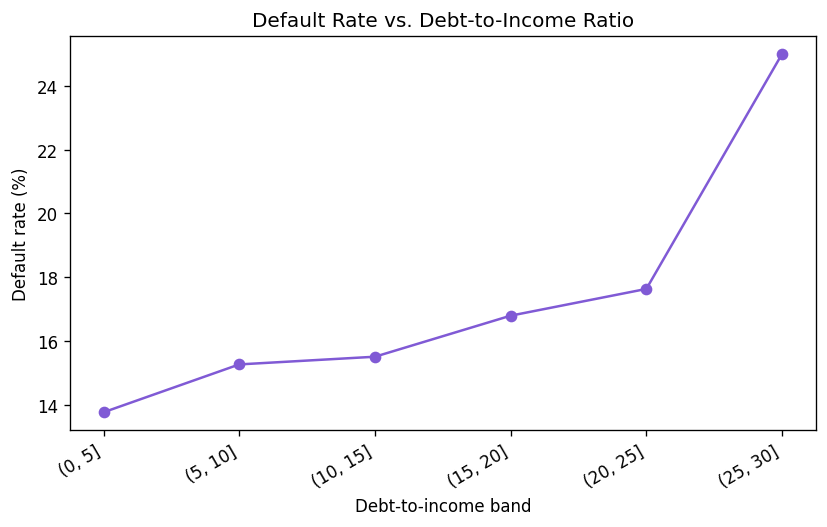

# Personal Lending Risk Analytics

**Author:** Viren Jawadwar
**Role:** Data Analyst (Portfolio Project)
**Contact:** virenjawadwar001@gmail.com · [LinkedIn](https://www.linkedin.com/in/viren-jawadwar-05a602264/) · [GitHub](https://github.com/Virenjawadwar08)

**Live dashboard:** `dashboard/index.html` — open it directly in a browser, no install needed. (Optional Tableau Public version: see `dashboard/TABLEAU_BUILD_GUIDE.md`.)

---

## Overview

Banks and P2P lenders sit on large volumes of loan-application data that,
if analyzed properly, can reveal which borrower and loan characteristics
correlate with default risk. This project builds an end-to-end analytics
pipeline — **Python for cleaning and feature engineering, MySQL for
structured analysis, and Tableau Public for the interactive dashboard**
— on a real anonymized lending dataset of ~9,600 loan applications.

The goal: give a bank's risk and lending teams a clear, interactive view
of **where default risk concentrates** (by loan purpose, credit score
band, and debt burden) so they can adjust underwriting policy and
pricing accordingly.

The interactive dashboard (`dashboard/index.html`) is a self-contained
HTML/JS app — filters recompute the charts live from the underlying
9,578 applications, and the Details tab is a searchable, sortable,
paginated table. No server, database, or install required to view it;
a SQL layer (below) documents the same analysis logic for anyone who
wants to run it against a real database.

## Business questions answered

- What is the overall default rate, and how does it differ between
  applicants who meet the bank's credit policy and those who don't?
- Which loan purposes carry the highest risk of non-repayment?
- How strongly does FICO score band predict default?
- Does a higher debt-to-income ratio meaningfully raise default risk?
- Which individual applications look "high risk" on multiple signals
  at once (missed policy, recent inquiries, delinquencies, public records)?

## Dataset

- **Source:** Public LendingClub-style personal loan dataset (~9,600
  applications, 14 original fields — credit policy, purpose, interest
  rate, installment, income, DTI, FICO, credit history length,
  revolving balance/utilization, recent inquiries, delinquencies,
  public records, and repayment outcome). Commonly used as a teaching
  dataset for lending risk analysis; sourced from a public GitHub
  mirror of the original Kaggle/LendingClub extract.
- **Raw file:** `data/raw/lending_data_raw.csv`
- **Cleaned file:** `data/processed/lending_data_clean.csv` (generated
  by the pipeline below — not committed pre-built so the grading/review
  process can see it run from scratch)

## Tech stack

| Layer | Tool | What it does |
|---|---|---|
| Cleaning & feature engineering | **Python** (pandas, numpy) | Dedupe, validate ranges, engineer FICO bands / income / credit-line-age fields |
| Exploratory analysis | **Python** (matplotlib) | Generates the 4 summary charts in `images/` |
| Structured analysis | **SQL** (MySQL-flavored) | Schema, ETL load, and the analytical queries backing every dashboard number — optional to actually run; documents the analysis logic |
| Dashboard | **HTML / JavaScript / Chart.js** | Self-contained interactive dashboard (`dashboard/index.html`) — 3 views (Summary / Overview / Details), live filtering, no install |
| Dashboard (optional) | **Tableau Public** | Same analysis rebuilt as a Tableau workbook — see `dashboard/TABLEAU_BUILD_GUIDE.md` if you want this version too |

## Project structure

```
.
├── data/
│   ├── raw/lending_data_raw.csv          # original extract
│   └── processed/lending_data_clean.csv  # output of 01_data_cleaning.py
├── notebooks/
│   ├── 01_data_cleaning.py               # cleaning + feature engineering
│   └── 02_exploratory_analysis.py        # generates images/*.png
├── sql/
│   ├── 01_schema.sql                     # MySQL DDL
│   ├── 02_load_and_transform.sql         # LOAD DATA + transform into analysis table
│   └── 03_analysis_queries.sql           # all dashboard-backing queries
├── dashboard/
│   ├── index.html                        # the interactive dashboard — open directly in a browser
│   ├── dashboard_data.json               # pre-aggregated + row-level data powering index.html
│   └── TABLEAU_BUILD_GUIDE.md            # optional: sheet-by-sheet Tableau build spec
├── images/                               # chart output (EDA + dashboard screenshots)
├── requirements.txt
└── README.md
```

## How to run it

### 1. Python — clean the data and generate charts

```bash
pip install -r requirements.txt
python notebooks/01_data_cleaning.py
python notebooks/02_exploratory_analysis.py
```

This writes `data/processed/lending_data_clean.csv` and four PNG charts
into `images/`.

### 2. View the dashboard

Just open `dashboard/index.html` in any browser (double-click it, or
drag it into a browser window). No server, no database, no install.
It has the same 3 views a Tableau workbook would (Summary / Overview /
Details), with live filters and a searchable applications table.

### 3. (Optional) MySQL — load and analyze

The SQL scripts document the same analysis in query form, useful if
you want to show SQL skills specifically or plug the data into a real
database:

```bash
mysql -u root -p < sql/01_schema.sql
# edit the file path in 02_load_and_transform.sql first, then:
mysql -u root -p --local-infile=1 < sql/02_load_and_transform.sql
mysql -u root -p < sql/03_analysis_queries.sql
```

### 4. (Optional) Tableau Public

If you specifically want a Tableau Public link for your resume, follow
`dashboard/TABLEAU_BUILD_GUIDE.md` — it specifies every sheet, field,
calculated field, and filter needed. This is optional; `dashboard/index.html`
already provides the same interactive analysis.

## Key findings

*(from `notebooks/02_exploratory_analysis.py` — regenerate with the
commands above; numbers below are from the current cleaned dataset)*

- **Overall default rate:** 16.0%
- Applicants who **do not meet the bank's credit policy** default at
  roughly **2x the rate** of those who do (27.8% vs. 13.2%).
- **Small business loans** carry the highest default rate of any
  purpose category, well above debt consolidation or credit-card
  refinancing loans — a candidate for tighter underwriting or
  risk-based pricing.
- Default rate falls sharply as **FICO band** improves, confirming FICO
  as a strong (if imperfect) risk signal on its own.
- **Debt-to-income ratio** shows a milder but still positive
  relationship with default risk — useful as a secondary signal
  alongside FICO rather than a standalone cutoff.

## Charts

| | |
|---|---|
|  |  |
|  |  |

## Dashboard preview

Open `dashboard/index.html` in a browser for the live version. Static
screenshots for quick reference:

| Summary | Overview |
|---|---|
|  |  |


## Notes on methodology

- FICO bands follow the standard industry ranges (Poor / Fair / Good /
  Very Good / Exceptional) rather than arbitrary quartiles, so the
  results are directly comparable to how lenders actually segment risk.
- The "high risk" flag used in the Details view is a simple rule-based
  heuristic (policy miss OR 2+ delinquencies OR 3+ recent inquiries OR
  any public record) rather than a fitted model — deliberately kept
  transparent and auditable rather than a black box, which matters for
  a lending-decisions context.
- No PII is present in the source dataset; all fields are financial/behavioral attributes only.

## License

This project is shared for portfolio purposes. The underlying dataset
is a public teaching dataset commonly used for lending-risk analysis
exercises.
